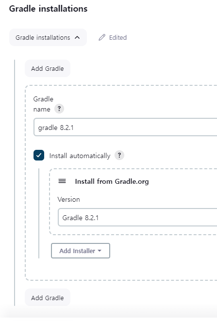
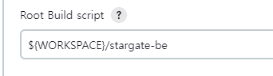

# JENKINS 셋업하기
> https://dev-overload.tistory.com/40

> EC2 상에 Jenkins 컨테이너를 생성하여 셋업하는 방식으로 운영하였다.

# 1. JENKINS 도커 이미지 및 컨테이너 생성하기

> Docker는 설치되었다는 가정하에 진행.

## a. Jenkins image pull하기

```docker
docker pull jenkins/jenkins:lts
```

- 프로젝트할 때에는 그냥 latest를 끌어오기는 했음.

## b. Jenkins Container 만들기

```
docker run --name <컨테이너 이름> -d -p 외부포트:8080 jenkins/jenkins
```
- 우리 코드
```
docker run --name stargate-jenkins -d -p 9090:8080 jenkins/jenkins
```

### 참고글
```bash
docker run --name jenkins-docker -d -p 9090:8080 -p 50000:50000 -v /home/jenkins:/var/jenkins_home -u root jenkins/jenkins:lts
```

- 여기서 -d 명령어는 백그라운드 실행, -p 명령어는 컨테이너와 호스트 PC 간 연결을 위해 내부 포트와 외부 포트를 묶은 것입니다.

- -v 명령어는 이미지의 /var/jenkins_home 디렉터리를 호스트 PC 내에 마운트 하는 명령어입니다. 
  - 이것을 하는 이유는, Jenkins 설치 시 ssh 키값 생성, 저장소 참조 등을 용이하게 하기 위함입니다.

- > 프로젝트 할때에는 -v 옵션 등은 설정 안하고 그냥 컨테이너만 생성했음 파일 옮길때만 추가 코드 작성.

## c. Jenkins 접속

```
젠킨스 도커 bash 접속:  docker exec -itu 0 <젠킨스 컨테이너 이름> bash
```
```
웹 접속(포트 9090으로 설정함) -> EC2서버주소:9090
```
- 0 이 필요한지 안필요한지 확인요망.

# 2. 젠킨스 초기 설정 및 세팅

> 젠킨스 완전 초기 비밀번호에 관해서는 검색해볼것(딴분께서 진행해서 못했음. 별거 없다고 함.)

## a. Plugins 설치 및 활성화

> Jenkins 관리의 Plugins 항목에서 아래의 요소를 활성화(또는 다운로드)한다.

- Gradle(gradle 프로젝트인 경우)
  - tools 에서 추가 설정 필요
- Maven? -> maven 사용한경우? 이거는 검색할것.(있는지 모름)
- `Push over SSH`
  - 빌드 후 jar 옮기기 위해 필요.
- git관련 플러그인 필요시 설치할 것
  - gitlab이라던지 그런게 있으면 알아서 추가설치.
  - 이게 뭐는 기본 설치되어있고 뭐는 설치 안되어있다고 해서 `검색해서 사용` 요망.

## b. Tools 세팅

> 이것도 젠킨스 관리 페이지에 있음(플러그인과 같은 페이지)

### JDK

- 도커의 jenkins 컨테이너가 아니라 외부 ubuntu에 깔린 jdk를 지정할 수 있는 모양이다.
  - 그래서 보면 절대주소로 시작하는 것을 볼 수 있음.


### Gradle

- gradle 플러그인을 깔면 보일것이다. 원하는 버전을 설정하면 된다.



> 추가설정할 것이 있으면 검색해서 채워넣기...

## c. System 세팅

> publish over ssh가 깔려있어야함. 보안상 이슈로 여긴 캡쳐안함.

- 쭉 아래로 내려온다(한 80%까지?)

- public over ssh를 찾는다.

- key 항목에다가 pem키를 텍스트편집기(vscode 등)으로 열어서 그 내용물을 복붙해 넣는다.

- ssh servers을 설정한다.
  - Name으로 jenkins에서 식별할 이름을 설정
  - Hostname은 EC2 서버의 주소를 입력
  - Username은 ubuntu상 유저의 이름을 쓴다.
  - Remote Directory는 /home/ubuntu를 사용할 수 있음(여기가 ssh 접속시 랜딩하는 디렉토리이긴함)

- 꼭 나갈 때 저장해.

# 3. 배포라인 만들기


## a. 프로젝트 생성
- 대쉬보드에서 `새로운 item`을 선택 </br>
  a. Freestyle project을 선택했음 </br>
  b. 여기서 다른 블로그글을 보면 pipeline하기도 함. 그건 알아서 배워용

- 원하면 `오래된 빌드 삭제`를 세팅해도 됨.

## b. 소스 코드 관리

- Git으로 선택

- Repository URL을 설정

- Credentials 추가 -> 이거는 내가 안해서 잘 모름.
아마 API토큰 관련으로 GitLab에서 설정(또는 토큰 생성)하면 될 것 같음.

- Branches to build
  - 빌드용 브랜치 설정하기. 예를 들어 be/develop 이런거. (문자열로 올바르게 작성할것)

- 빌드유발 

> 이거는 프로젝트 관리자 맘대로 정하기
> 우리는 Build when...pushed to Gitlab(주소)으로 해서 `Accepted Merge Request Events`으로 함.

## c. 빌드환경

> 이거는 따로 설정 안함.

## d. Build Steps (핵심부분)

### I. invoke gradle script

> gradle을 먼저 실행시켜 프로젝트를 빌드한다.

- invoke gradle으로 해서 plugin으로 설치하고 tools에서 설정한 gradle를 선택한다.

- tasks는 bootjar으로 설정했다.

- 고급을 펼치고 좀 내려가면 `Root Build script`가 나온다. 이거는 프로젝트 구조상 gradlew.bat이 있는 디렉토리를 설정하면 되는데 jenkins가 project를 pull하는 주소가 설정되어있기 때문에 `${WORKSPACE}`으로 그 주소를 받아온다.
  - 그 뒤에다가 gradlew.bat이 있는 위치까지 가면 된다.
  - gradlew가 핵심이라기보다 그냥 백엔드 프로젝트 최상단에 gradle 파일 몰려있는데로 잡으면 된다.




### > !여기까지 만들었으면 한번 수동 빌드를 수행해 볼것.
> Git pull을 해서 파일 구조를 만들어놔야 아래의 단계 (보안 파일 추가)가 쉬워짐 <br/>
> (git에서 관리 안하는 application.properties 등)을 추가.

### I.a 보안파일 추가해주기

> application-secret.properties등 보안파일을 빌드에 추가해야한다. 

> ssh으로 연결된 cli를 통해 docker cp로 파일 복사를 실행할 것이다.

1. 우선 FileZila나 scp커넥션 등을 통해 필요한 application파일 등을 ubuntu 서버로 옮긴다.

2. 적절히 아래 코드를 변형하여 보안 파일을 jenkins container으로 넣는다.

> 참고 : https://www.baeldung.com/ops/docker-copying-files

```
docker cp <보내는 파일 주소(폴더도 되긴함)> 컨테이너명(컨테이너 코드도 됨):컨/테/이/너/속/주/소
```

- 예시
  - 참고로 파일 주소는 현재 cli를 실행하는 폴더 위치에 따라 경로를 설정해주면 된다. (상대주소면)
  - 절대주소는 알지?
```
docker cp resources/application-secret.properties stargate-jenkins:/var/jenkins_home/workspace/BaikSeungYoon-CDCI/stargate-be/src/main/resources/
```

- 도커 jenkins 컨테이너 들어가보기 
```
docker exec -it <컨테이녀 명> /bin/bash
```


### II. Send files or execute commands over SSH

> 여기서는 build한 jar파일을 ssh으로 우분투 서버로 전송해서 도커이미지를 생성할 것임.

- SSH 서버는 위에서 `publish over ssh`에서 설정한 서버를 선택하면 된다. 
  - 선택지가 안보이면 위에거 설정 안한거임. 가서 해.

- Source files는 jenkins에서 빌드한 jar 파일인데 구조상 원래 빌드 결과물이 나오는 곳을 찾아가면 된다.

- remove prefix으로는 jenkins상 빌드 파일의 경로(이름 제외)를 주면 된다.
  - 아마 이거 안하면 destination에 그래도 파일 구조 만들 것 같음.

- remote directory는 위의 `publish over ssh`에서 설정한 remtoe directory에 추가되는 경로로 보면 됨.
  - 위에서 /home/ubuntu으로 설정했으니 거기부터 경로를 따지면 됨

- Exec command는 실행할 ubuntu 커맨드 목록임.

> !!! 참고로 우리 경우 /home/ubuntu/jar에 dockerfile을 만들어 놓았었음 <br/>
> 따로 dockerfile에 대해 설명은 않겠다. 검색해.

dockerfile(확장자 없음)
```
from openjdk:17
copy stargate.jar app.jar
entrypoint ["java","-jar","/app.jar"]
```


- 여기까지 진행되어서 `docker container ls`를 실행시켜서 원하는 컨테이너가 실행되면 postman이나 기타 도구를 써서 테스팅 해볼것.
- 만약 `docker container ls`를 해서 안뜨면 `docker container ls -a`으로 확인해보고 created는 몇초전인데 status가 EXITED가 뜨면 spring boot이 실행되다 터진 것이라 생각하면 된다.
- 이러면 아마 docker logs 등으로 로그 확인해서 검토해볼 것.

## d. 빌드 후 조치

> 일단 암것도 설정 안함. 원하면 보고 추가할것.

# 4. gitlab에 webhook 달기

> webhook을 달아야 jenkins에게 신호가 간다.

## a. jenkins에서 token 만들기

> 2개의 값을 복사해야한다. 빌드 유발 섹션으로 간다.

- 빌드 유발 섹션의 Build when a change...옆에 있는 gitlab webhook URL을 복사한다.

- 빌드 유발 섹션 -> 고급 펼치기 -> 맨 아래의 Secret token옆의 Generate 버튼을 누르고 랜덤키를 설정. -> 복사하기

## b. gitlab에서 webhook 걸기
- Gitlab repository 내부의 settings > webhook으로 가기

- URL은 아까 복사한거 넣고 secret token도 복사한거 넣기.
- 이벤트를 설정한다.(우리는 merge request events으로 함.)
- 한번 test를 해보고 되면 저장. 안되면 알아서 디버깅.

# 끝