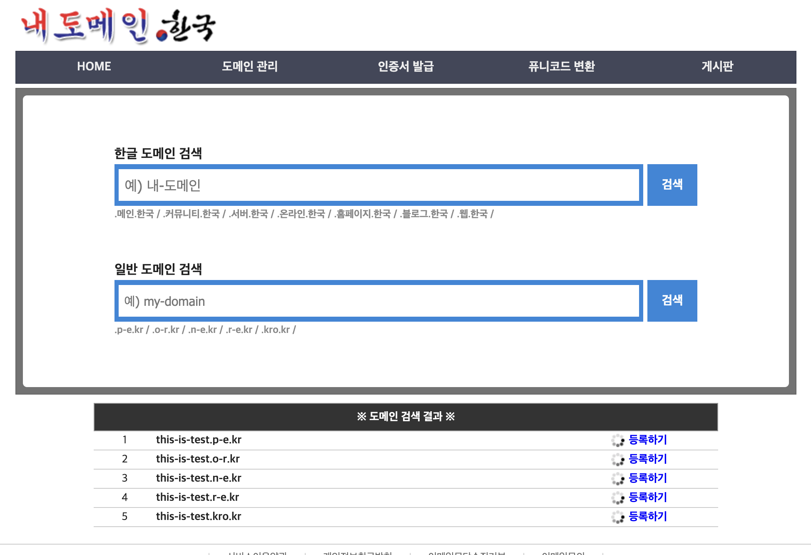
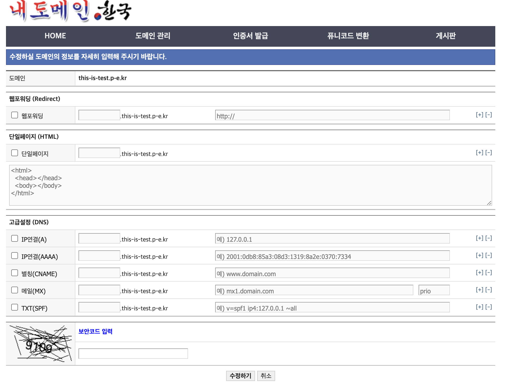
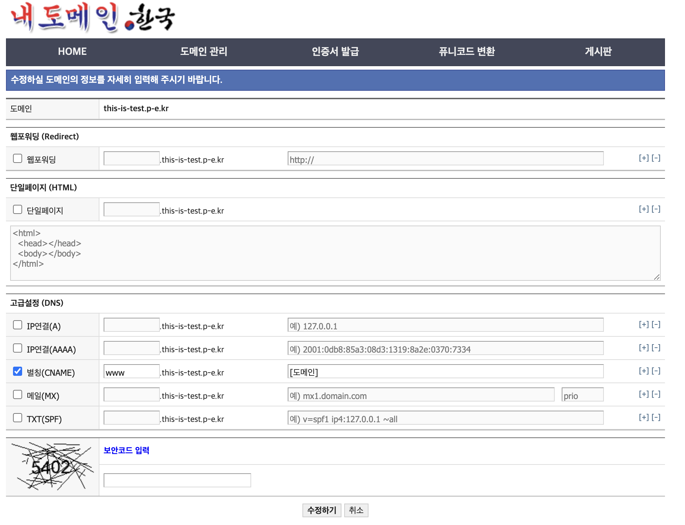

# nginx 구축

## nginx 설치

1. 소프트웨어 패키지 정보 최신으로 업데이트한다.

    ```bash
    sudo apt-get update
    ```

2. nginx를 설치한다.

    ```bash
    sudo apt-get install nginx
    ```


## 리버스 프록시 설정

1. `/etc/nginx/nginx.conf` 파일을 접근한다.

    ```bash
    sudo vim /etc/nginx/nginx.conf
    ```

2. include 아래 부분을 수정한다.

    ```
    ##
    # Virtual Host Configs
    ##
    
    include /etc/nginx/conf.d/*.conf;
    include /etc/nginx/sites-enabled/*;
    
    ## 추가: 웹요청을 받아 다른 서버로 전달하여 처리
    server {
            server_name [도메인 주소];
    		    listen 80;
    
            location / {
                    proxy_set_header HOST $host;
                    proxy_pass http://127.0.0.1:8080;
                    proxy_redirect off;
            }
    }
    ```

    - Front와 Back을 `/`와 `/api`로 분기하고 싶다면 다음과 같이 설정한다.
      (여기서는 Back만 적용되어있다.)

        ```
        ##
        # Virtual Host Configs
        ##
        
        include /etc/nginx/conf.d/*.conf;
        include /etc/nginx/sites-enabled/*;
        
        ## 추가: 웹요청을 받아 다른 서버로 전달하여 처리
        server {
                server_name [도메인 주소];
        		    listen 80;
        
                location / {
                        # front later
                }
                location /api {
                        proxy_set_header HOST $host;
                        proxy_pass http://127.0.0.1:8080;
                        proxy_redirect off;
                }
        }
        ```

3. 설정을 적용하기 위해 nginx를 재시작한다.

    ```bash
    sudo service nginx restart
    ```

4. 80포트에 대한 인바운드 규칙을 설정한다.

    ```bash
    sudo ufw allow 80
    ```


# HTTPS 적용

1. certbot 설치한다.

    ```bash
    sudo apt-get remove certbot # 기존에 있던 Certbot을 제거하고
    sudo snap install --classic certbot # snap으로 재설치한다
    ```

    - certbot은 공식 홈페이지에서 snap을 통해 설치하는 것을 권장하고 있다.
        - certbot
            - 무료 SSL/TLS 인증서 발급 및 갱신 도구이다.
            - 무료 인증서은 90일까지 사용 가능하다.
        - snap
            - 자동 업데이트을 제공하여 최신 버전의 Certbot 유지가 가능하다.
2. nginx서버에 등록된 호스트에 대하여 인증서를 발급받는다.

    ```bash
    sudo certbot --nginx
    ```

    - 다음과 같이 설정이 나오면 순차적으로 입력한다.
      (이메일 주소 / ‘Y’ / ‘Y’ / HTTPS를 적용할 도메인)

        ```bash
        # sudo certbot --nginx
        Saving debug log to /var/log/letsencrypt/letsencrypt.log
        Enter email address (used for urgent renewal and security notices)
         (Enter 'c' to cancel): [이메일 주소]
        - - - - - - - - - - - - - - - - - - - - - - - - - - - - - - - - - - - - - - - -
        Please read the Terms of Service at
        https://letsencrypt.org/documents/LE-SA-v1.3-September-21-2022.pdf. You must
        agree in order to register with the ACME server. Do you agree?
        - - - - - - - - - - - - - - - - - - - - - - - - - - - - - - - - - - - - - - - -
        (Y)es/(N)o: Y
        - - - - - - - - - - - - - - - - - - - - - - - - - - - - - - - - - - - - - - - -
        Would you be willing, once your first certificate is successfully issued, to
        share your email address with the Electronic Frontier Foundation, a founding
        partner of the Let's Encrypt project and the non-profit organization that
        develops Certbot? We'd like to send you email about our work encrypting the web,
        EFF news, campaigns, and ways to support digital freedom.
        - - - - - - - - - - - - - - - - - - - - - - - - - - - - - - - - - - - - - - - -
        (Y)es/(N)o: Y
        Account registered.
        Which names would you like to activate HTTPS for?
        We recommend selecting either all domains, or all domains in a VirtualHost/server block.
        - - - - - - - - - - - - - - - - - - - - - - - - - - - - - - - - - - - - - - - -
        1: [도메인 주소]
        - - - - - - - - - - - - - - - - - - - - - - - - - - - - - - - - - - - - - - - -
        Select the appropriate numbers separated by commas and/or spaces, or leave input
        blank to select all options shown (Enter 'c' to cancel): 1
        ```

    - HTTPS 도메인 설정 시 에러 발생

        ```bash
        Requesting a certificate for [도메인 주소]
        An unexpected error occurred:
        Error creating new order :: too many certificates already issued for "ssafy.io". Retry after 2023-08-07T10:00:00Z: see https://letsencrypt.org/docs/rate-limits/
        Ask for help or search for solutions at https://community.letsencrypt.org. See the logfile /var/log/letsencrypt/letsencrypt.log or re-run Certbot with -v for more details.
        ```

        - 원인: 해당 도메인에 대한 발급 횟수가 한도가 도달했기 때문에 발생한다
        - 해결: 다른 서브 도메인을 설정한다.
            1. [내도메인.한국](https://xn--220b31d95hq8o.xn--3e0b707e/)에서 무료 도메인을 발급받기위해 회원가입 후 로그인한다.
               (발급받은 도메인은 90일 사용 가능한다.)
            2. ‘일반 도메인 검색’에 원하는 도메인을 적은 후 ‘검색 버튼’을 누른다.

               

            3. 원하는 도메인을 선택하여 등록 및 설정 페이지에 들어간다.

               

            4. ‘고급설정 (DNS)’의 ‘별칭(CNAME)’을 체크하여 도메인 주소와 연결시켜준 후 저장한다.

               

            5. `/etc/nginx/nginx.conf` 파일을 접근하여 `도메인 주소`을 새로운 `서브 도메인 주소`로 변경한다.

                ```
                ##
                # Virtual Host Configs
                ##
                ...
                server {
                        server_name [서브 도메인 주소];
                	   ...
                }
                ```

            6. 설정을 적용하기 위해 nginx를 재시작한다.

                ```bash
                sudo service nginx restart
                ```

            7. 인증서를 다시 발급받는다.

                ```bash
                sudo certbot --nginx
                ```


3. `/etc/nginx/nginx.conf` 파일을 접근하여 80포트(http) 접속 시 443포트(https)로 리다이렉트 하도록 변경한다.

    ```
    listen 443 ssl; # managed by Certbot
        ssl_certificate /etc/letsencrypt/live/www.stargate-a406.kro.kr/fullchain.pem; # managed by Certbot
        ssl_certificate_key /etc/letsencrypt/live/www.stargate-a406.kro.kr/privkey.pem; # managed by Certbot
        include /etc/letsencrypt/options-ssl-nginx.conf; # managed by Certbot
        ssl_dhparam /etc/letsencrypt/ssl-dhparams.pem; # managed by Certbot
    
    }
    
    server {
        if ($host = [도메인 주소]) {
            return 301 https://$host$request_uri;
        } # managed by Certbot
    
        server_name [도메인 주소];
        listen 80;
    
          # 수정: http request https로 redirect
        location / {
                return 301 https://$host$request_uri;
        }
    }
    ```
    
    - `# managed by cerbot`은 certbot에 의해 생성된 부분이다.
4. 설정을 적용하기 위해 nginx를 재시작한다.

    ```bash
    sudo service nginx restart
    ```

5. 443포트에 대한 인바운드 규칙을 설정한다.

    ```bash
    sudo ufw allow 443
    ```


# 그 외 설정

## Request 사이즈 설정

- nginx에서 허용하는 최대 request 사이즈는 기본적으로 `1MB` 이다.
- 만약 고해상도 이미지 파일을 담아서 보내게되면 최대 request 사이즈가 넘어가 다음과같이 `413 Request Entity Too Large` 에러가 발생할 수 있다.
1.  `/etc/nginx/nginx.conf` 파일을 접근하여 다음과 같이 `client_max_body_size`을 설정해준다.

    ```
    http {
    	...
    	# 추가: request 최대 사이즈 설정
    	client_max_body_size 12M;
    	...
    }
    ```

2. 설정을 적용하기 위해 nginx를 재시작한다.

    ```bash
    sudo service nginx restart
    ```